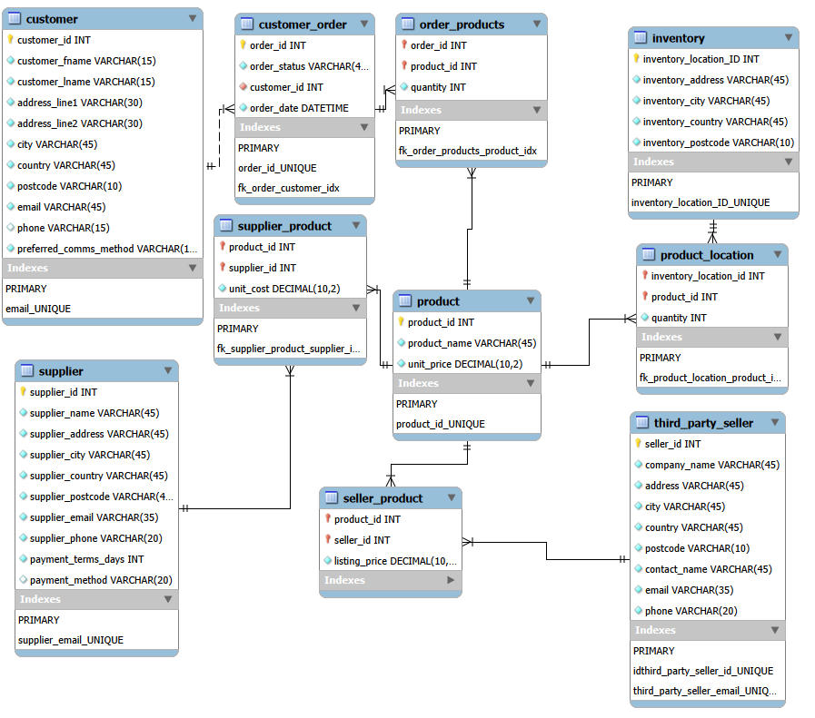

# ecommerce-sql-analysis
Relational database design and SQL analysis project based on an e-commerce business scenario.

## Project Overview

This project involved designing and building a relational database for an e-commerce business that needed to manage customers, products, orders, inventory, suppliers and third-party sellers, as well as the relationships between them.

I began by creating an EER diagram based on a template provided as part of the DIO SQL course I was undertaking. I used the core parent entities from the original scenario, but adapted the model by creating additional relationship tables to support the relationships I wanted to represent, defining the appropriate primary and foreign keys for the design.

Once the model was complete, I manually created the database and its tables in MySQL, defining the required attributes, data types and constraints. I then populated the database with synthetic data created specifically for the project and validated the tables to ensure that keys, constraints and data-quality checks were working as intended.

With the database populated and relationships established, I used AI-generated business questions based on the dataset as prompts for analysis, then independently translated those questions into SQL queries to retrieve, aggregate and analyse the data.

## Database Design

When creating the EER diagram, I noticed that as I was designing the main entities, there were some relationships that could not be represented without creating additional tables.

For example, after creating `customer_order` and `product`, there was no way to link the two tables. I considered adding `product_id` to `customer_order`, but quickly realised this would create a problem because an order can contain more than one product. As one order can have many products, and one product can also appear in many orders, I needed a bridge table to connect them.

I therefore created `order_products`, using `order_id` and `product_id` as a composite primary key so that each row could uniquely identify a specific product within a specific order. This table also allowed me to add `quantity`, which belongs to the relationship between an order and a product rather than to either table individually.

I used the same approach for the other many-to-many relationships in the database, creating bridge tables to connect products with suppliers, inventory locations and third-party sellers.
